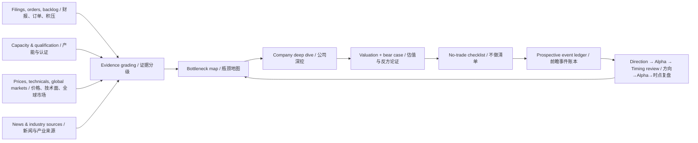

# AI Supply Chain Research OS | AI 供应链研究与决策系统

<p align="center">
  
  
  
  
  
</p>

> An evidence-led research operating system for identifying where AI infrastructure bottlenecks are moving—and separating durable company alpha from theme beta and narrative.
>
> 一套以证据为核心的 AI 基础设施研究系统，用于识别供应链瓶颈迁移，并区分公司 Alpha、主题 Beta 与市场叙事。

The repository turns public filings, orders, backlog, capacity, product qualification, market data, and event history into an auditable research workflow. It covers GPUs, HBM and advanced packaging, optical networking, copper interconnects, power and cooling, storage, and emerging physical-AI dependencies.

本仓库将公开财报、订单、积压订单、产能、产品认证、市场数据与事件历史组织成可审计的研究流程，覆盖 GPU、HBM/先进封装、光通信、铜互连、电力散热、存储及物理 AI 新兴环节。

## Executive Snapshot | 核心概览

| Dimension / 维度 | System design / 系统设计 |
|---|---|
| Core question / 核心问题 | Where is the next binding AI supply-chain constraint, and which companies have measurable exposure? / 下一个 AI 供应链硬约束在哪里，哪些公司具备可量化敞口？ |
| Evidence hierarchy / 证据层级 | A: filings/orders/guidance; B: customer or industry confirmation; C: commentary; D: rumor / A：公告订单指引；B：客户或行业交叉验证；C：评论；D：传闻 |
| Decision layers / 决策分层 | Theme direction → company alpha → execution timing / 主题方向 → 公司 Alpha → 执行时点 |
| Risk discipline / 风险纪律 | Falsifiable thesis, no-trade checklist, valuation state, correlation, and narrative-drift controls / 可证伪论点、不做清单、估值状态、相关性与叙事漂移控制 |
| Validation / 验证 | Historical event studies plus prospective event ledger; no accuracy claim before minimum sample gates / 历史事件研究 + 前瞻事件账本；达到样本门槛前不声称准确率 |
| Operating status / 运行状态 | v3.4 execution-optimization system; earlier reports are retained as an audit archive / v3.4 执行优化系统；旧报告保留为审计档案 |

## Historical Research Return | 历史研究回报

The table below summarizes **median post-event theme-basket returns** from [`historical_theme_backtest_summary_v1_2026-05-24.csv`](03_backtests_and_scripts/historical_theme_backtest_summary_v1_2026-05-24.csv). It is the closest defensible ROI-style evidence in the repository:

下表汇总主题瓶颈事件后的**主题篮子历史中位回报**，来源为上述可复算 CSV。这是仓库中最接近“投资回报率”、且有数据依据的展示方式：

| Theme / 主题 | Events / 事件数 | 20D median / 20日中位回报 | 60D median / 60日中位回报 | 120D median / 120日中位回报 | 252D median / 252日中位回报 | 252D vs QQQ / 相对QQQ | 252D vs SMH / 相对SMH |
|---|---:|---:|---:|---:|---:|---:|---:|
| Optical networking / 光通信 | 6 | **+10.15%** | **+13.52%** | **+19.91%** | **+56.78%** | **+43.20%** | **+32.52%** |
| Power & cooling / 电力与散热 | 5 | +0.20% | **+8.68%** | **+35.16%** | **+44.58%** | **+22.52%** | **+8.67%** |
| Copper interconnect / 铜互连 | 2 | +5.61% | -2.05% | +1.69% | +39.39% | +25.80% | +15.11% |
| Advanced packaging & HBM / 先进封装与HBM | 5 | +2.59% | +12.09% | +6.02% | +6.62% | -15.43% | -29.28% |

**Method note / 方法说明：** horizon-level sample counts decline when a full forward window is unavailable; for example, the optical study has six 20-day observations but four 252-day observations. These are equal-weight theme event studies, not a continuously rebalanced portfolio.

由于部分事件没有完整远期区间，各期限样本数会下降；例如光通信在 20 日有 6 个观察值，在 252 日只有 4 个。结果属于等权主题事件研究，不是持续再平衡组合。

> **Professional interpretation / 专业解读：** the optical and power/cooling results justify deeper research, but they do not prove a repeatable trading edge. Sample sizes are small, theme baskets may contain selection or survivorship bias, and the table does not model portfolio sizing, taxes, liquidity, slippage, or transaction costs.
>
> 光通信与电力散热的历史结果支持继续深挖，但不足以证明可重复交易优势。样本量较小，主题篮子可能存在选择或幸存者偏差，且未纳入仓位、税费、流动性、滑点和交易成本。

## Research Architecture | 研究架构



The feedback loop matters: failed signals, theme-only returns, weak cash conversion, valuation compression, and thesis drift are written back into the framework instead of being hidden.

反馈闭环是系统核心：失败信号、仅由主题 Beta 驱动的上涨、现金转化不足、估值压缩与论点漂移都会回写到框架，而不是被隐藏。

## Coverage Map | 研究覆盖

| Layer / 环节 | Representative questions / 代表性问题 |
|---|---|
| Compute / 算力 | GPU/accelerator demand, customer concentration, product cycles / GPU与加速器需求、客户集中度、产品周期 |
| HBM & advanced packaging / HBM与先进封装 | Memory wall, CoWoS/TCB capacity, yield, equipment intensity / 内存墙、CoWoS/TCB产能、良率与设备强度 |
| Networking / 网络 | 800G/1.6T optics, DSP/linear-drive, copper reach, switch cadence / 800G/1.6T光模块、DSP/线性驱动、铜互连距离与交换机周期 |
| Power & cooling / 电力散热 | Grid access, switchgear, UPS, liquid cooling, backlog conversion / 并网、电气设备、UPS、液冷与 backlog 转收入 |
| Storage & data movement / 存储与数据移动 | Flash/HDD demand, inference data pipelines, interface constraints / 闪存/硬盘需求、推理数据管线与接口约束 |
| Physical AI / 物理AI | Magnets, motion control, sensing, industrial qualification / 磁材、运动控制、传感器与工业认证 |

## Decision Framework | 决策框架

### Evidence grades | 证据分级

| Grade / 等级 | Evidence / 证据 | Permitted use / 允许用途 |
|---|---|---|
| A | Official order, backlog, guidance, 10-Q/10-K / 官方订单、backlog、指引、10-Q/10-K | Event ledger and thesis update / 进入事件账本并更新论点 |
| B | Customer/supplier cross-check, industry data, certification or production milestone / 客户供应商交叉验证、行业数据、认证或量产节点 | Strong watch or event ledger / 强观察或进入事件账本 |
| C | Broad management language, media, sell-side commentary / 泛化管理层表述、媒体、卖方评论 | Observation only / 仅观察 |
| D | Forum post, rumor, unsourced market share / 论坛、传闻、无来源份额 | Excluded from decisions / 不进入决策 |

### Three tests of edge | 三层有效性检验

1. **Direction / 方向：** did the theme basket beat QQQ or SMH over 20/60/120 days? / 主题篮子是否在 20/60/120 日跑赢 QQQ 或 SMH？
2. **Company alpha / 公司Alpha：** did the selected company beat its own theme basket while the thesis was confirmed? / 所选公司是否跑赢主题篮子，且核心论点被验证？
3. **Execution / 执行：** did the event-based action improve return or reduce drawdown? / 基于事件的动作是否改善收益或降低回撤？

Only when all three layers are supported should the system claim evidence of investment edge.

只有三层均得到数据支持，系统才可以讨论投资优势。

## Quick Start | 快速开始

### 1. Enter through the active system | 从当前系统入口开始

- [`execution_plan_v3_4.md`](00_active_system/execution_plan_v3_4.md) — current execution plan / 当前执行方案
- [`lean_decision_system_v1.md`](00_active_system/lean_decision_system_v1.md) — minimum viable decision rules / 精简决策规则
- [`prospective_event_ledger_v2.csv`](00_active_system/prospective_event_ledger_v2.csv) — prospective evidence ledger / 前瞻证据账本
- [`no_trade_checklist_v1.csv`](00_active_system/no_trade_checklist_v1.csv) — anti-overtrading gate / 防止过度交易的门槛
- [`model_validation_protocol_v1.md`](00_active_system/model_validation_protocol_v1.md) — validation definitions / 验证标准
- [`framework_validity_audit_v1.md`](00_active_system/framework_validity_audit_v1.md) — what has and has not been proven / 已证实与未证实事项

### 2. Run the public-data pipeline | 运行公开数据管线

```bash
python3 realtime_data_pipeline/run_pipeline.py
```

Key outputs / 主要输出：

```text
realtime_data_pipeline/data/processed/model_ingest_latest.csv
realtime_data_pipeline/data/processed/events_history.csv
realtime_data_pipeline/data/processed/technical_indicators_latest.csv
realtime_data_pipeline/data/processed/global_market_context_latest.csv
realtime_data_pipeline/data/processed/global_market_theme_summary_latest.csv
realtime_data_pipeline/reports/realtime_snapshot_latest.md
```

### 3. Enable the optional analysis environment | 启用可选分析环境

```bash
./scripts/setup_analysis_env.sh
./scripts/run_with_analysis_env.sh scripts/check_analysis_env.py
```

Dependencies are installed under `.analysis_deps/` and remain isolated from the system Python environment.

依赖安装在 `.analysis_deps/`，不会污染系统 Python 环境。

## Repository Map | 仓库结构

```text
00_active_system/          Current decision rules and validation controls / 当前决策规则与验证控制
01_reference_models/      Bottleneck, valuation, stress and driver models / 瓶颈、估值、压力与驱动模型
02_company_deep_dives/    Company-level diligence and revenue bridges / 公司级尽调与收入桥
03_backtests_and_scripts/ Event studies, walk-forward tests and source data / 事件研究、滚动验证与源数据
04_watchlists_strategy/   Watchlists, catalysts and execution matrices / 观察名单、催化剂与执行矩阵
realtime_data_pipeline/   Public-information ingestion and market context / 公开信息摄取与市场上下文
strategy_package_2026-05-25/  Reproducible strategy package and charts / 可复现策略包与图表
99_archive_superseded/    Superseded material retained for audit / 为审计保留的旧版本
```

## Validation Gates | 验证门槛

Before claiming model accuracy, the prospective ledger requires at least:

在声称模型具备准确率之前，前瞻事件账本至少需要：

- 20 prospective events / 20 个前瞻事件
- 4 distinct themes / 4 个不同主题
- No single theme above 40% of the sample / 单一主题占比不超过 40%
- No single company above 3 events / 单一公司不超过 3 个事件
- A pre-event thesis and falsification condition for every observation / 每个观察均有事前论点与证伪条件
- Individual return, theme-basket return, QQQ/SMH return, and alpha vs theme / 个股回报、主题篮子回报、QQQ/SMH回报与相对主题Alpha

The current framework audit explicitly states that the available walk-forward set contains only five theme windows. That is enough for research hypotheses, not for a stable accuracy claim.

当前框架审计明确指出，已有 walk-forward 集合只有五个主题窗口，足以形成研究假设，但不足以声称稳定准确率。

## What Makes This Professional | 专业性原则

- **Source traceability / 来源可追溯：** claims link back to filings, IR releases, datasets, or explicit source logs / 结论回溯至公告、IR、数据集或来源日志。
- **Alpha attribution / Alpha归因：** a rising stock is not automatically a successful company call if the whole theme rose more / 若主题涨幅更高，个股上涨不自动等于选股成功。
- **Falsifiability / 可证伪：** every thesis includes evidence that would invalidate it / 每个论点均需写明何种证据会推翻它。
- **Decision hygiene / 决策卫生：** no-trade rules, valuation, correlation, and liquidity are part of the process / 不做规则、估值、相关性与流动性均进入流程。
- **Honest uncertainty / 诚实面对不确定性：** small samples and model failures are disclosed, not polished away / 小样本与模型失败会被披露，而不是被包装掉。

## Limitations & Disclaimer | 局限与免责声明

Historical event returns can be affected by hindsight, theme construction, survivorship bias, overlapping windows, regime changes, and unavailable point-in-time information. Company fundamentals, market prices, and industry conditions can change rapidly. Re-run the analysis with current, licensed, point-in-time data before relying on any conclusion.

历史事件回报可能受到后见偏差、主题构造、幸存者偏差、窗口重叠、市场状态变化及历史时点信息缺失的影响。公司基本面、价格与行业环境变化很快，使用任何结论前应基于最新、合规且时点一致的数据重新验证。

**This repository is for research and education only. It is not investment advice, an offer to buy or sell securities, or a guarantee of future returns.**

**本仓库仅用于研究与教育，不构成投资建议、证券买卖要约或未来收益保证。**
