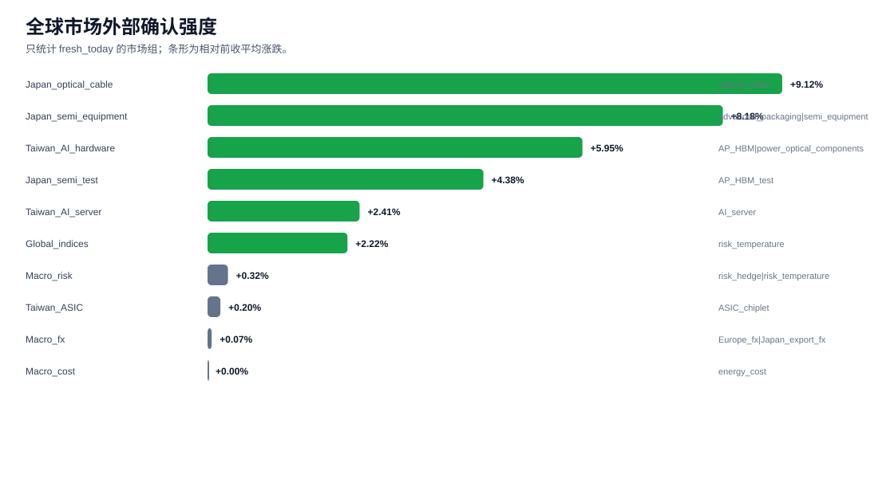
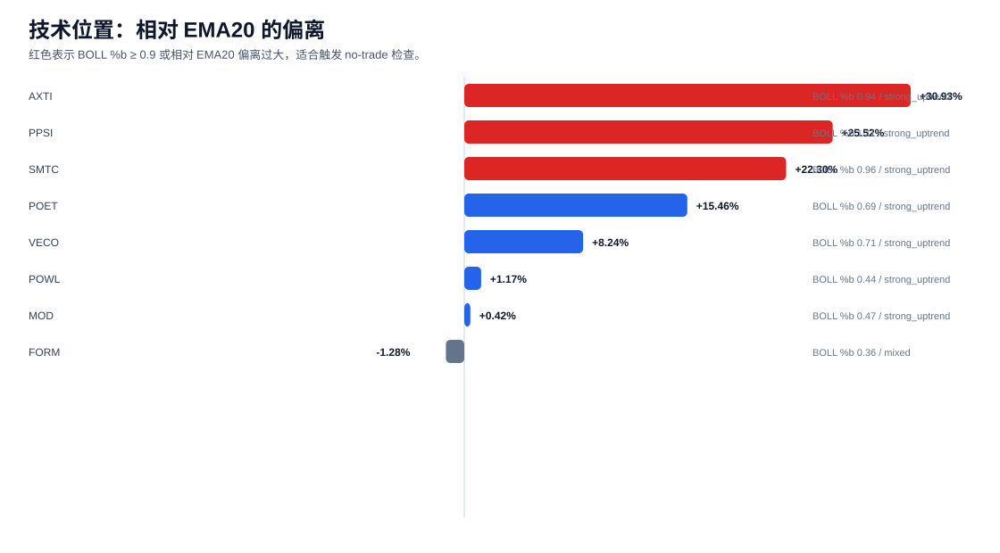
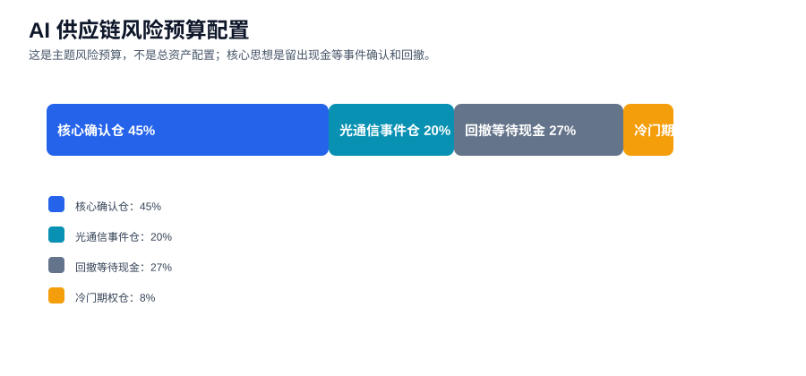
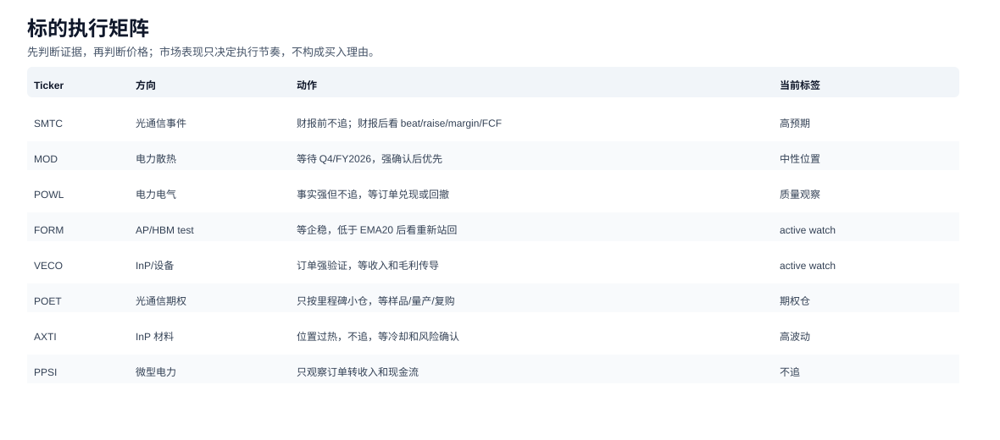

# AI 供应链综合策略包

生成时间：2026-05-25 00:38:14  
定位：把实时事件、全球市场上下文、EMA/BOLL 技术位置和 v3.4 no-trade 纪律合成一份可执行策略。  
说明：这是研究框架，不是个人投资建议。

## 一句话结论

方向继续看多 `光通信上游 + 电力/散热 + AP/HBM test`，但执行上不追最热票。当前最优动作是保留现金，等 SMTC/MOD 财报和美股恢复交易后的价格确认。

## 图 1：全球市场外部确认

解读：日本半导体设备、测试、光纤线缆，以及台湾 AI 硬件是今天最强外部确认。韩国和欧洲数据如果是 `stale`，不能当作当天新信号。

## 图 2：EMA/BOLL 技术位置

当前需要特别防追高的标的：`SMTC, AXTI, PPSI`。这些标的不是方向错，而是位置已经不便宜，需要事件确认或回撤。

## 图 3：风险预算配置

建议把 AI 供应链主题风险预算拆成：核心确认仓 45%、光通信事件仓 20%、回撤等待现金 27%、冷门期权仓 8%。同一风险簇超过 35% 自动降权。

## 图 4：标的执行矩阵

## 当前分层策略

| 桶 | 标的/方向 | 当前动作 |
|---|---|---|
| 核心确认仓 | MOD, POWL, FORM, VECO | 等公司级确认和合适技术位置，优先处理 MOD/VECO/FORM |
| 光通信事件仓 | SMTC, VECO, POET, MTSI/MXL watch | SMTC 财报前不追；财报后看 beat/raise/margin/FCF |
| 回撤等待现金 | 全部高热标的 | 等回到 EMA20 或 BOLL %b 0.4-0.7 |
| 冷门期权仓 | POET, AXTI, PPSI | 小仓/观察，只有 milestone 才升级 |

## 技术纪律

- 高于或接近 BOLL 上轨，且没有新的 A/B 级公司事实：不加仓。
- 距 EMA20 超过 20%：默认触发 `NT01 valuation/price extension`。
- 低于 EMA20 但基本面未破坏：进入等待企稳区，而不是立刻否定 thesis。
- 冷门票只按里程碑处理，不按故事补仓。

## 最新价格与技术表

| Ticker | Close | EMA20偏离 | BOLL %b | Trend | 动作 |
|---|---:|---:|---:|---|---|
| SMTC | 156.78 | +22.30% | 0.96 | strong_uptrend | 财报前不追 |
| MOD | 260.52 | +0.42% | 0.47 | strong_uptrend | 等财报确认 |
| POWL | 279.22 | +1.17% | 0.44 | strong_uptrend | 等回撤/兑现 |
| FORM | 128.99 | -1.28% | 0.36 | mixed | 等企稳 |
| VECO | 59.55 | +8.24% | 0.71 | strong_uptrend | active watch |
| POET | 14.59 | +15.46% | 0.69 | strong_uptrend | 期权仓 |
| AXTI | 140.83 | +30.93% | 0.94 | strong_uptrend | 不追 |
| PPSI | 5.21 | +25.52% | 1.11 | strong_uptrend | 不追 |

## 全球市场摘要

| 主题组 | 新鲜度 | 平均前收涨跌 | 解读 |
|---|---:|---:|---|
| Europe_AP_equipment | 0/1 | +1.18% | no_fresh_today_signal |
| Europe_power_semis | 0/2 | +6.57% | no_fresh_today_signal |
| Europe_semi_equipment | 0/1 | +4.74% | no_fresh_today_signal |
| Global_indices | 2/3 | +2.22% | positive_external_confirmation |
| Japan_optical_cable | 2/2 | +9.12% | positive_external_confirmation |
| Japan_semi_equipment | 3/3 | +8.18% | positive_external_confirmation |
| Japan_semi_test | 1/1 | +4.38% | positive_external_confirmation |
| Korea_HBM_equipment | 0/1 | -3.61% | no_fresh_today_signal |
| Korea_memory_HBM | 0/2 | -1.14% | no_fresh_today_signal |
| Macro_cost | 1/1 | +0.00% | mixed_or_neutral |
| Macro_fx | 2/2 | +0.07% | mixed_or_neutral |
| Macro_risk | 3/3 | +0.32% | mixed_or_neutral |
| Taiwan_AI_hardware | 2/2 | +5.95% | positive_external_confirmation |
| Taiwan_AI_server | 2/2 | +2.41% | positive_external_confirmation |
| Taiwan_ASIC | 1/1 | +0.20% | mixed_or_neutral |

## 数据快照

本 folder 已保存生成时使用的数据快照：

- `data_snapshot/global_market_theme_summary_latest.csv`
- `data_snapshot/global_market_context_latest.csv`
- `data_snapshot/technical_indicators_latest.csv`
- `data_snapshot/prices_latest.csv`
- `data_snapshot/model_ingest_latest.csv`
